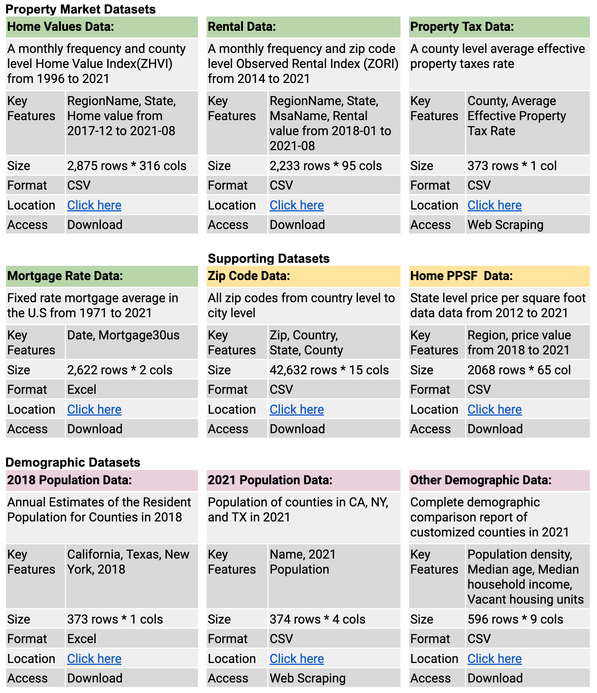
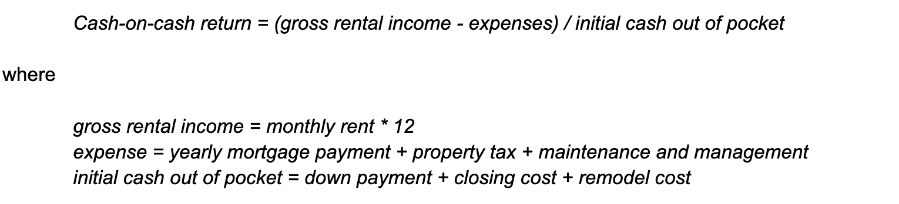
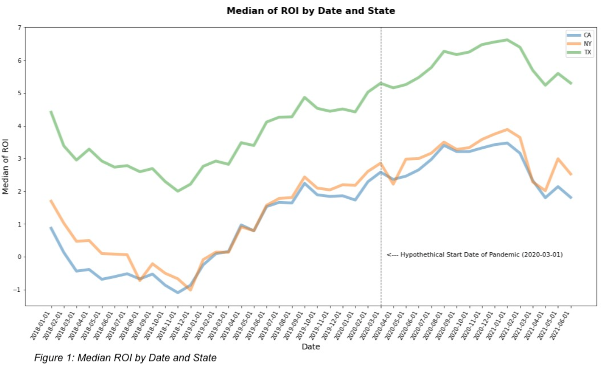
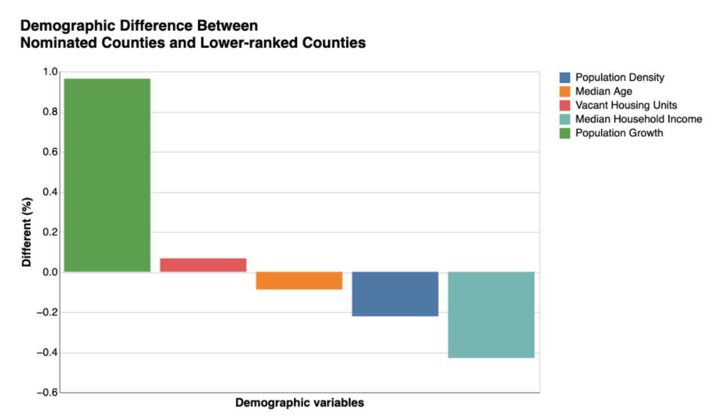

# Rental Property ROI Analysis 

SIADS591&592 Milestone I Project University of Michigan MADS Authors: Cliff Gong, Gen Ho, Xinqian Zhai 

## Introduction

The U.S. housing market has seen a sharp increase during the Covid pandemic, with Redfin forecasting record home sales of $2.53 trillion in 2021, a 17% year-over-year gain. However as home prices continue to go up, what about the rental market? 
 
In this project, we've studied the before and since pandemic Residential Rental Property Return on Investment (ROI) for any substantial pattern change and tried to understand which factor contributes the most. We've also identified which counties are more favorable to rental property investors. Overall, this study would like to answer the two questions 'when' and 'where' are favorable times and places for rental property investors aiming for steady cash flow, which involves studying ROI trends across different counties plus demographic data such as population density and median household income in order to identify possible patterns.

## Data Source

## Data Manipulation 

The focus of our data manipulation is to facilitate the calculation of ROI for each point in time. We define ROI in this study as the cash-on-cash return with the following formula:

**Cash-on-cash return = (gross rental income - expenses) / initial cash out of pocket**

where

gross rental income = monthly rent * 12
expense = yearly mortgage payment + property tax + maintenance and management
initial cash out of pocket = down payment + closing cost + remodel cost

This data manipulation work is heavy, containing multiple types of data sources,webscsrap, and data manipulation techniqus to prepare.  The work can be found in the **return_calculation.ipynb, webscrap_PropertTaxRateData.ipynb, get_pop_growth_rate.ipynb, and demographic_analysis.ipynb notebooks**.

## Data Analysis and Visualization

In this section, we analyzed the data based on the questions below and presented our results using various visualizations.

Questions:
1. Has there been any change of ROI trend since pandemic? 
2. Among selling price, rent and mortgage rate, which factor impacts the ROI most? 
3. Is there any change of correlation between Mortgage Rate and ROI before and since pandemic?
4. Which county is more favorable to rental property investment? 
5. What are the demographic attributes for countries that are more favorable for rental property investment?

### Conclusion

In this study, we found the ROI (cash-on-cash return) trend within the period of Jan 2018 to Jun 2021 was not affected by covid pandemic even though the housing market has undergone a meteoric rise since the pandemic (fig.1).

Among house selling price, rent, and mortgage rate, mortgage rate has the highest correlation with ROI. We observed the strength of correlation between ROI and mortgage rate is reduced when comparing before and since pandemic period, and the difference is statistically significant (p < 0.05). Among the candidate states, namely CA, NY and TX, Texas is the most favorable for rental property investors who aim for steady cash flow. 

Also, counties with higher population growth rate but lower population density, younger communities and relatively lower median household income are more favorable (fig.2). 

## A detailed project report can be found here:

[SIAD 591/592 Milestone1 Project Report - Rental Property ROI Analysis](https://github.com/AbbyZhai/Rental-Property-ROI-analysis-Project/blob/main/Project_Report.pdf)

## License

All data sources and python libraries used are open source to the best of our knowledge.
